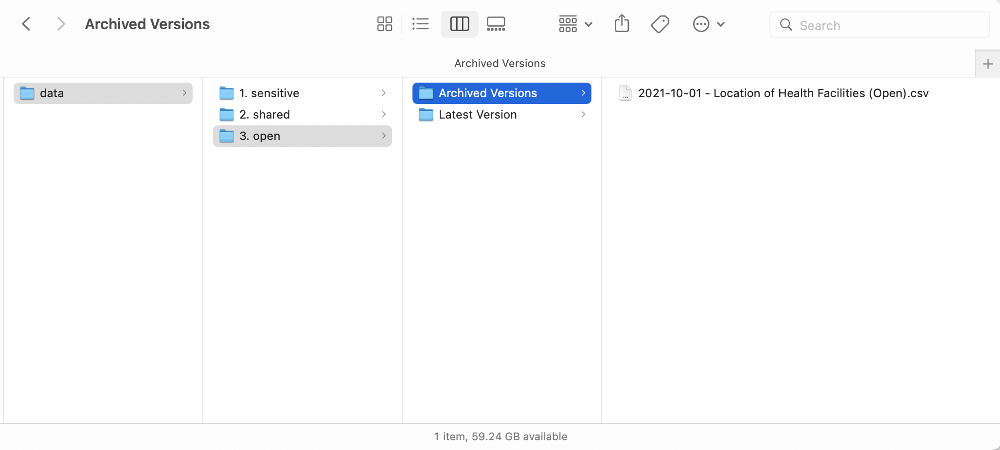

**Data Architecture — Reducing Data Frictions & Creating an Effective Data System for an Organization**

<small>

Presentation for [Conflux Center](https://www.confluxcenter.org/) workshop on "Technologies and Digital Tools for Peacekeeping and Political Mission" - January 2022.

[timdavies.org.uk](https://www.timdavies.org.uk) | [@timdavies](https://www.twitter.com/timdavies) | tim@practicalparticipation.co.uk

</small>

----
# Instructions

<small>
This presentation is made with reveal.js. Reveal slides are less linear than a usual deck - and this presentation is divided into sections (working across) and the contents of each section (working down).

You can

* Use the keyboard to navigate slides using across or down arrows (see bottom-right of each slide for available directions)
* Press ESC (Escape) on the keyboard to see a full overview of the deck. 
* Press 'S' to open speaker view and access detailed speaker notes.

You can also:

* [Go here](presentation.md) to access the presentation source (Markdown)
</small>

----
# Overview

* An introduction to data architecture
* Simple good practices to reduce friction
* Data stewardship as a shared responsibility
* In practice: Civic Media Obsevatory

Notes:

In this talk I want to try and offer you both a high-level view of data architecture, coming from the perspective of a 'data humanist' - someome who believes we need data and data-related tools to serve human organisations, rather than the other way around - and to offer you some practical ideas around bottom-up data architecture, recognising that few of us on this call generally have the power to shape every element of the data environments we work in, but that we can all take on some shared responsibilities for data stewardship. 

I should start with a disclaimer. I'm not a trained enterprise data architect; nor do I spend much of my day-to-day work on data architecture within large organisations. Rather, over the last decade I've been a researcher and action-researcher, exploring the sharing and use of data in social impact work, particularly in large-scale international collaborations. I've worked on elements of the human and technical 'architectures' for projects like the International Aid Transparency Initiative and the Open Contracting Partnership, bringing greater transparency and interoperability to flows of data around aid and procurement. And I've worked to support groups like the International Open Data Charter think about the different 'data stacks' needed nationally and internationally to tackle issues like corruption, climate change, agricultural development and land governance. Few of those projects have had the opportunity for any 'top-down' design, but instead have involved improvising with data, and developing ad-hoc architectures. 

So - if there are any formal enterprise data architects amongst us - the approach I'm going to explore might not be the orthodoxy. But I think it's closer to the reality of how organisations can make data work day-to-day for practitioners on the front-line, challenging the centralising tendencies of technology, and striking a dynamic balance between seeking structure and order, and allowing freedom to innovate and respond in a changing world. 

----

## What is data architecture? 

<!-- .slide: data-background="./images/blueprint.jpeg" -->

Notes:

With that said, let's explore: what is data architecture? Well, if you turn to reference works on the subject, you are likely to find a lot of discussion of **enterprise** data architecture that looks at a number of different stages and levels.

---

### Stages of data architecture

* **Conceptual** - all the 'entities' in the data
* **Logical** - how the 'entities' relate
* **Physical** - how data about them is stored or accessed

Notes:

In an idealised model, assuming you can start from scratch, you would ask yourself: "What is this data about?", that is, what are all the conceptual entities or things that need to be in our data? That might be projects, people, partners, funders, work packages, workshops, receipts or reimbursement claims. 

You would then ask: Logicallly - how do these things relate? Or, more precisely, what relationships between them are **important** for the kind of uses we want to put our data to. For example, we might know that we need to report to funders on the particular partners whose participation we funded in a workshop, and they may request details of receipts for an audit, so we want to have some chain of relationships right from our project funders, to workshop reimbursement receipts. 

And then you would ask: Where is that data going to be **physically** stored? Do we have a central CRM (Contact Relationship Management) system everyone can access? A cloud based file-sharing system? Or is everyone working in the field on laptops without reliable Internet connections?

---

### Layers of data architecture (Zachman Framework)

* Scope/Contextual
* Business Model/Conceptual
* System Model/Logical
* Technology Model/Physical
* **Detailed Representations**

Notes:

In the Zachman framework for enterprise data architecture we find a further prompt to think about the **detailed representation** of the data wherever it is stored. That is, which fields should be there, and how should the database be represented. Combined with considerations from the earlier layers, this might involve thinking about whether a particular database field should be free-text, or should be based on a drop-down selection from some reference code-list, or whether and how translation and multilingualism should be supported. 

Generally, at the point of implementation, there will be significant compromises involved. You might **want** to be able to capture information in all local languages and scripts, but if some legacy system you have to use doesn't interpret unicode characters correctly, you might end up having to require data is transliterated before entry. 

Or you might want data on the organisations you are partnering with to be validated against a lookup list, but the business process to get new organisations onto that list might be out of your control, so you end up having to keep 'Organisation name' as free-text and think about other business processes that might cross-check data when reports are to be generated and shared.

---

### Architecture beyond the data

* Models
* Policies
* Rules
* Standards

Notes:

Quickly you will find the tools of data architecture are not just technology tools. Instead, alongside data models, you will need policies for how people handle data, rules or procedures for data capture and entry, standards for how particular information is recorded, and all sorts of formal or ad-hoc business processes around the data.

---

## Data Architecture in practice

* People
* Processes
* Stewardship

Notes: 

In reality, few of us have the chance to start from scratch with a data architecture. And even if we do, organisations and inter-organisational projects and problem spaces, are rarely amenable in practice to top-down impose architectures. Reducing friction in data sharing in practice is as much about daily work with people, processes and stewardship, as it is about capturing requirements and developing abstract data models. 

The analogy between data and physical architecture is useful here. 

---

### Seeing like a database

<!-- .slide: data-background="./images/Brasilia.jpeg" -->

Notes: 

There have been many grand designs to rationalise data organisation and flows, but, much like top-down architectural masterplans, these attempts often fail. Many people have extended the critique James S Scott outlined in his book 'Seeing Like A State', of how bureacratic rationalisation runs up against the lived reality of messy social organisation, to data systems. 

Design from the top rarely works at the grassroots. 

(Image credit: https://commons.wikimedia.org/wiki/File:Brasilia_aerea_torredetv1304_4713.jpg)

---

### Following the desire lines

<!-- .slide: data-background="./images/desire_paths.jpeg" -->

Notes:

Instead, data archicture may be better off following, or at least understanding, the 'desire lines'. We've all seen paths like this: the architect likes the neat right-angle corner of the paths. But pedestrians have worn their own path into the soil. 

There are paths like this right across our data systems. When people find a database with validation rules that lead to the computer always saying 'no' to the data they want to enter, they may turn to entering information in an unstructured notes field. Or if systems take too many steps to log-into, they may simply not enter data into the required system at all - keeping notes on paper or in local files. 

Even if you never get near where 'enterprise' data archicture decisions are made, or your organisational context has little central architecture going on, you can still draw upon your understanding of the daily data flows around you to improve how data is managed. 

(Photo credit: https://www.flickr.com/photos/funfilledgeorgie/8890970206)

---

### Four ways or 'architecting for data'

* Architectures for data management
* Architectures for data security
* Architectures for building data culture
* Architectures for data use

Notes:

Rahul Bhargava, in [an article I shared for the background reading](https://ssir.org/articles/entry/architecting_for_data) suggests that we all have a role in asking questions about the ways our organisations use data, and that we might want to think about four aspects of architecting for data.

In thinking about how data is managed, Rahul encourages organisations to make sure data is as organised, described, accessible and usable as possible. These are essentially ways of reducing the friction to finding and working with a given set of data. We'll come to some particular strategies for this shortly. 

He goes on to highlight the importance of designing for data security. That means thinking carefully about the appropriate levels of security for the kind of data you hold. One simple starting practice is to make sure you clearly separate sensitive from non-sensitive data. That can enable you to adopt both the right tools, and mental models, when working with different kinds of data. 

Rahul also discusses architectures of data culture, adressing question of whether your organisation wants to be 'data centric', 'data driven', or 'data informed', using data alongside other sources of insight. Building data culture (and maintaining good data practices) in an organisation might involve establishing working groups, communities of practice, training opportunities and other collaborative fora to build organisation-wide ownership of good data management. 

Lastly, he looks at architectures of data use. In short, there's little point making data collection perfect, unless that data is feeding some process or decision making. And if you can build the right feedback loops, then data use becomes the biggest driver of data quality and better data management. 

---

### Architecture from the ground up

Data architecture can: 

* reduce friction where it needs to; 
* adds friction it where it should be there;
* be top down;
* work better bottom up;
* involve ongoing data stewardship.

Notes:

So, if I try and sum up here an idea of 'data architecture from the ground up':

* reduces friction where it needs to; 
* adds it where it should be there;
* can be top down;
* works better bottom up;
* involves ongoing data stewardship.

On this last point, whilst there are now formal job roles of 'data steward', I hope I'll be able to show in the next section how everyone can play their part in improving organisational data pratices bit by bit. 

----

# Simple good practices to manage friction

---

## What kinds of friction are we worried about?

* Technical
* Semantic
* Social

<!-- .slide: data-background="./images/Ac30.gif" -->

Notes:

First, let's think about all the kinds of frictions that impact our work with data. 

It's worth noting though that friction has a number of impacts. It can slow things down, add costs, and at it's worst it can cause a total breakdown. 

For example, without standardised data on aid projects from the International Aid Transparency Initiative, some country governments might spend weeks of labour re-typing information from donor reports, and spend whole meetings just reporting what activities are taking place, rather than analysing and discussing. With standardised data reducing the friction, most of that effort can be spent on data-informed decision making instead.

But too little friction can also be a problem. 

For example, if you're handling sensitive data, you want staff to pause before the data gets shared, and to make sure suitable risk-assessments and privacy protections are in place. Or, if the data you are dealing with doesn't easily fit into the available data categories of the template you are using, you might want to think about talking to the template-owner to improve it, rather than putting square pegs into a round hole. 

---

### Technical frictions

*Wrong format? Wrong version? Encoding errors?*

Use lowest-common-demonominator open standards. 

Don't rely on formatting to convey meaning. 

Notes: 

I'm sure you've all experienced the issue at one point or another, or trying to open a file, and finding out you don't have the right software or version of a program, or that when you open it, the file is garbled. 

This is why many data projects look to rely on lowest-common-denominator open standards when **exchanging data**. Formats like CSV for tabular data rather than Excel, GeoJSON for geographic data, rather than proprietary Geographic Information System formats, and XML for exchanging richly structured data, rather than database dumps from particular database software. 

These might not allow you to save files with all the features of the software you used to create them, like colouring spreadsheet cells, or embedding media alongside geographic shapes - but by working with common open standards there is an increased chance your data can be meaningfully exchanged with others. 

---

### Semantic frictions

Notes:

Data is information taken out of context. 

That's the point of it. It helps us move information from one context or locality to another, to combine information, and to analyse it in new ways.

But it's very easy for meaning to get lost, or confused - unless there is standardisation.

And that create major frictions for data use, requiring data users to spend all their time working out what the data means, rather than working with the data.

---

### Social frictions

*"Computer says no."* 

*"I'm not sure we're aloud to share this data."*

*"We're not alowed to use online tools for data analysis."*

Notes: 

Some of the biggest barriers to effective data sharing and use come because individuals and organisations are not sure how to work with data. 

Having clarity about the sensitive data that needs to handled carefully, and the data that can be easily shared and analysed with the rights tools for the job, can avoid data-paralysis, where information is under-used simply because of low confidence and high-confusion. 

---

## What can we do about it? 

* Keep data tidy
* Identify things clearly
* Document the data
* Automate
* Visualise and validate

Notes:

All the strategies I'm going to describe now assume you are carrying out 'data architecture from the bottom-up', although if you have the role and authority to be part of some middle-out, or top-down data architecture, hopefully you will also see potential ideas here. 

---

### Keep data tidy

<!-- ADD IMAGE: Filing structure -->

Notes:

That means keeping things tidy within files and around files.

For example, if you handle sensitive data, make sure you have clear conventions for where data can be kept and how it is named, so people know whether the data they are looking at is up-to-date, and whether it's the authoritative copy, or and outdated version.

In idealised data architectures, data might always be accessed from servers, so you don't end up with multiple copies. But, the reality of many organisations is that copies of data proliferate. 

Regularly re-visiting good practices for data filing, and keeping things tidy, can go a long way to minimise the frictions, confusions and failures that can come from this. 

---

### Tidy data

* Every column is a variable.
* Every row is an observation.
* Every cell is a single value.

Notes: 

It's also important to keep data tidy inside the dataset. There is a convention for data scientists called 'Tidy Data' which makes data easier to process. 

I'm not going to go in depth into it now, but it's good to have an understanding of if you find yourself designing spreadsheets or data collection tables often.

In practice, the right structure for any dataset depends on the use and users - but it should **always be possible to transform** your data into a tidy data form. 

---

### For example

Notes:

Both tables above contain the same data, but only the second one is tidy. 

Once you data is tidier, you can start to build it into bigger data architectures and ecosystems.

---

### Identify things clearly

Notes:

Let's look at this tidied dataset again. I've cut off some of the details here, but you will see I've added in two new columns for the date and title of the workshop this data records information about. It's no good expecting the computer to extract this information from the folder where the data is filed, or from the filename. If I want this data to be part of the information I store or exchange, I need to make it explicit.

But I want to focus on some of the other columns here. Almost all the columns describe things that are not specific to my dataset. They describe currencies, organisations, dates, people and so-on. 

If I want to make it easier to join up my data with other data in the organisation, it helps to standardise.

The first step to that is to go through some question for every column in your data:

---

### Standardising

* Has someone else already defined this? Do other datasets have similar columns? 
* If I search, can I find an authoritative list of [ currencies ; organisations ; locations etc. ] used in our organisation?
* Can I turn this free-text box into a controlled list? 

Notes:

Sometimes you are going to find the answer is that the organisation has three or four ways of identifying a particular thing - and then there is an architectural choice: which lists of identifiers does it make most sense to align with. 

---

### Document the data: Meta-data

* Structured
* Contextual
* Documentation

Notes:

Now - even if your data is tidy, and you've used common codelists, that doesn't mean someone else will imediately be able to understand it. 

There are many ways to do documentation, from including a 'meta-tab' in a spreadsheet, to writing a codebook, or providing a web or intranet page about the dataset. 

A good practice is to keep documentation as close to the data as possible, and that's where the Frictionless Data Package specification from the Open Knowledge Foundation is useful. 

---

### Frictionless data packages

Notes:

Here you've got an example of a 'frictionless data package', with a need folder structure, and a README file packaged alongside the data. Only some of the readme file is shown here, but the whole thing describes all the different sources used to generate this data, some of the choices made in preparing the data, and the code used to automate updates to the dataset. 

Whether or not you use the full frictionless data package spec, including a README file alongside your datasets can be a good step to increase data re-use, and reduce mistakes or misuse. 

---

### Automate

Notes:

I want you to also notice that little 'Data | Valid' icon on screen. That tells me that the creators of this dataset have setup some automation to help make sure their data is tidy, valid and frictionless. 

The tidier data is, the easier it becomes to automate common process with well-documented code. Developing the in-house skills, or finding partners who can help you, with adding elements of automation to your data handling, is well worth exploring. 

---

### Visualise and validate

<iframe src="https://tools.humdata.org/wizard/#datacheck" width="100%" height="800px"/> 

Notes:

The particular automation that sits behind that little icon is data validation: a computer process of checking if there are errors in the data which would introduce new frictions. Data validation generally focusses on the **structure** of data, but it's also important to regularly check that the **semantics** are being communicated right. 

The tools around the Humanitarian Exchange Languge, HXL, offer a good example of this done well - offering a data check validator AND a 'quick charts' service which allows you to take a well-structured dataset and visualise it. You know your data, and you'll quite probably be able to spot when there are unexpected outliers or issues that come up when it's graphed or mapped. 

---

## Data stewardship as shared responsibility

* Leave things tidier than when you arrived;
* Look for connections, and suggest them;
* Dataset friction is an invitation for conversation

Notes:

Before we move to a worked example of bottom-up data architecture, I want to leave you with three ideas to put into practice when thinking about data stewardship and data architecture as a shared responsibility. Remember, as we saw earlier - data architecutre is not just about the shape of the datasets - it's about all the processes that go on around data. 

* Leave things tidier than when you arrived;
* Look for connections, and suggest them;
* Dataset friction is an invitation for conversation;

Sometimes friction can be fixed with changes to data; sometimes it reveals deeper business process challenges that need to be worked through. 

----

## In practice: the Civic Media Observatory

Notes:

So, I know I've covered a lot of ground - and before ending, I wanted to give just a small worked example. I'm sharing this by kind permission of Global Voices, who I worked with on the project - and whose work I thought would be of wider interest to this seminar too. 

---

## Bottom up architecture

Notes:

The Civic Media observatory is a project seeking to track, translate and explain media and social media conversations across language and cultural barriers: looking for the subtext that an outside readers or content moderators might miss. Each instance of the observatory works with a team of country expert researchers, who identify trending social media items, and then analyse them, looking for common themes and frames and, potential negative impacts. The results of the analysis feed both into media reporting by Global Voices, where, for example, content appears to be inciting violence, directly into the response processes of partner organisations. 

At the heart of the project is a large AirTable containing records for each of the media items analysed, linked to related tables for media sources, themes, narrative frames, locations and so-on.

---

## Following the desire lines

Notes: 

But this database was not designed top-down, it's evolved over the last two years through use. We started literally around a table in Skopje, Northern Macedonia, with a team of researchers looking at media items, and working out what they wanted to say about them.

We started sketching a database design, and bit-by-bit, worked out which columns should be free text, which should be controlled lists, and which needed to be relationships. We tried a few different tools, from simple spreadsheets, to Drupal websites - but settled on AirTable as the right mix of flexibility and control. 

We built the capacity of a few members of the team to tidy up the AirTable structure, and I've remained on-hand to support with more technical fixes if ever data structures become misaligned. 

Through seeing how researchers were using the database over time we've dropped some fields, renamed others, and changed the way relationships worked.

---

## Privacy-first design

Notes:

The table you are looking at how is the public version of the database, but behind the scenes each individual team of researchers has their own observatory, which includes some additional columns not seen here, mainly used for project management to track which researcher is working on which media item and so-on. In the backend observatories, fields are clearly marked as SHARED or PRIVATE, and the automated process used to copy data once and hour from the individual observatories to the public dataset is set-up to not transfer any sensitive data. 

In some of the most recent updates, the Global Voices team added more access control to individual fields, so that only editors were able to mark an item as complete enough and ready to be visible to the public. 

---

## Not everything is connected

Notes: 

As you saw in the database diagram a few slides back, there are lots of relationships in the data architecture: for example, relating each media item to a location, or to a theme.

Intially, we thought we would need to have a single location table, and single themes table, which was referenced across all the individual observatories. But we quickly ran into a business-process problem: 

* Each observatory is more or less a self-contained project, with its own editors and team. 
* It's not clear who should take on responsibility for keeping a 'global' locations or themes table tidy.
* If there is someone else who has to maintain that table, and people wanting to link an item to a new location or theme have to submit a request for it to be created in that table, it could introduce a big delay to them completing their media analysis. 

So, we looked carefully at whether there were use-cases that demanded shared identifiers for themes and locations between different observatories - and decided that the use cases for that did not justify adding complexity to data creation. We accepted that our data architecture was not perfectly 'normalised', but it was the right choice to distribute work fairly across people creating and using the data. 

---

## Reducing friction at each point

Notes:

Lastly, we also looked beyond our project, to find if there were any existing standards that could help us reduce the friction in our researchers work. 

For example, we identified that a chunk of researcher time went into just the titles, dates and author details from the online media items they were analysing. 

In many cases, these are already encoded in a web page using meta-data standards, and so we wrote a small 'Bookmarklet' - a piece of code that can be run in any web browser, to automatically grab data from pages to be analysed, and feed that into our database using it's open API (another added benefit we found from building on top of AirTable). 

---

## Ongoing support

Notes:

Whilst the architecture of the observatory has more-or-less stabilised, the data architecture is never entirely complete. 

I continue to provide light-touch support to the project. A lot of the time, that is just being responsive to quick questions to give the team work on the project the confidence to keep adapting the tools to fit their needs, and checking that any evolution doesn't cause workflows around the data to break. 

----

# Recap

* Data architecture = Tech, people, processes, stewardship
* Reducing friction = Technical, Semantic, Social
* Architecture from the bottom up = think tidy data, think relationships, automate, visualise, tailor

----

# Further reading & resources

* [Architecting for Data](https://ssir.org/articles/entry/architecting_for_data)
* [Tidy data](https://cfss.uchicago.edu/notes/tidy-data/)
* [Frictionless Data Packages](https://frictionlessdata.io/)
* [Humanitarian Data Exchange](https://tools.humdata.org/)
* [Global Voices Civic Media Observatory](https://globalvoices.org/special/observatory/)
* Contact me: tim@practicalparticipation.co.uk

---

